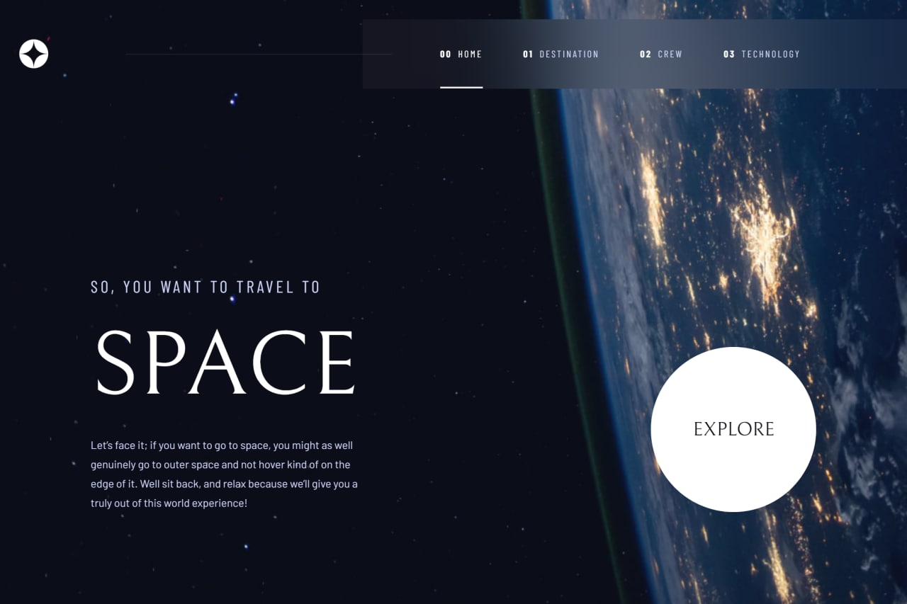

# Frontend Mentor - Space tourism website solution

This is a solution to the [Space tourism website challenge on Frontend Mentor](https://www.frontendmentor.io/challenges/space-tourism-multipage-website-gRWj1URZ3).

## Table of contents

- [Frontend Mentor - Space tourism website solution](#frontend-mentor---space-tourism-website-solution)
  - [Table of contents](#table-of-contents)
  - [Overview](#overview)
    - [The challenge](#the-challenge)
    - [Screenshot](#screenshot)
    - [Links](#links)
    - [Built with](#built-with)
    - [What I learned](#what-i-learned)
    - [Continued development](#continued-development)
    - [Useful resources](#useful-resources)
  - [Author](#author)
  - [Acknowledgments](#acknowledgments)

## Overview

### The challenge

Required making it possible for users to be able to:

- View the optimal layout for each of the website's pages depending on their device's screen size
- See hover states for all interactive elements on the page
- View each page and be able to toggle between the tabs to see new information

### Screenshot



### Links

- Solution URL: [Link to Code](https://github.com/Zeuhz-Droid/space-toursim-website-main)
- Live Site URL: [Hosted site](https://zeuhz-droid.github.io/space-toursim-website-main/)

### Built with

- Semantic HTML5 markup
- CSS custom properties
- Flexbox
- CSS Grid
- Desktop-first workflow
- [Sass](https://sass-lang.com/) - Sass/SCSS syntax
- [JavaScript](https://www.javascript.com/) - JavaScript

### What I learned

1. I learned or rather practiced and updated my sass markup/codes.
2. setting up the package.json file to support sass and the whole build process.
3. In javascript, I learnt and implemented event delegation _Code appended Below_, as well as the function scope.
4. I also learnt and implemented a slider function that programmatically builds a slider based on the number of slides available.
5. The code below are some of the HTML, CSS and javascript code i am proud to implement as a developer.

```html
<li class="destination__item">
  <a href="#" class="destination__link" id="current-2" data-planet="moon"
    >Moon</a
  >
</li>
```

```css
.btn {
  appearance: none;
  border: none;
  outline: none;
  cursor: pointer;
  color: $clr-dark;

  &--explore {
    height: 27.4rem;
    width: 27.4rem;
    border-radius: 50%;
    background-color: $clr-white;
    position: relative;
    z-index: 9;
  }

  &--ripple {
    height: 100%;
    width: 100%;
    border-radius: 50%;
    background-color: rgba($clr-white, 0.5);
    position: absolute;
    z-index: -10;
  }

  &--explore:hover &--ripple {
    animation: ripple 0.8s ease-in-out infinite;
  }
}
```

```js
destinationHeader.addEventListener('click', function (e) {
  const clicked = e.target.classList.contains('destination__link');

  if (clicked) {
    destinationPlanets.forEach(planet => {
      planet.classList.add('hide');
      if (e.target.dataset.planet === planet.dataset.planet) {
        planet.classList.remove('hide');
      }
    });
  }
});
```


### Continued development

Right now, my main and continual focus is javascript and my next project will be done and implemented using the OOP paradigm as opposed to functional programming as used in this project.

### Useful resources

- [MDN](https://developer.mozilla.org/en-US/) - This is practically every developer go to for understanding mechanism of any code syntax, keyword, method or function and so on. It was really instrumental for me in these aspect

## Author

- Website - [Zeuhz Droid](comingSoon...)
- Frontend Mentor - [@Zeuhz-Droid](https://www.frontendmentor.io/profile/Zeuhz-Droid)
- Twitter - [@yourusername](https://twitter.com/zeuhzDroid)

## Acknowledgments

As usual, Glory to GOD
special appreciation to my tutor, Mr. Jonas Schedtmann, He really helped me become a better developer with his detailed and explanatory courses.


